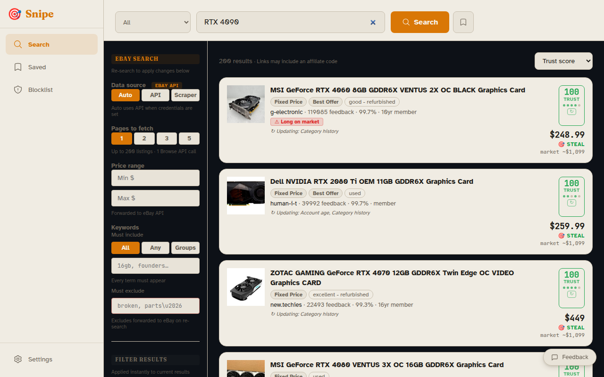
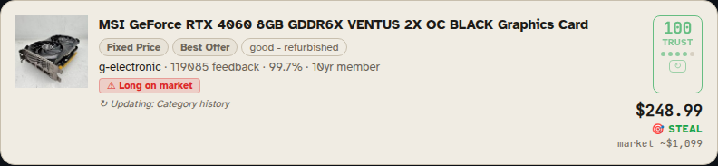

# Snipe — Auction Sniping & Listing Intelligence

> *Part of the Circuit Forge LLC "AI for the tasks you hate most" suite.*

**Status:** Active — eBay listing intelligence MVP complete; Mercari search + trust scoring live. Auction sniping engine and additional platforms are next.

**[Documentation](https://docs.circuitforge.tech/snipe/)** · [circuitforge.tech](https://circuitforge.tech)

## Quick install (self-hosted)

**Requirements:** Docker with Compose plugin, Git. No API keys needed to get started.

```bash
# One-line install — clones to ~/snipe by default
bash <(curl -fsSL https://git.opensourcesolarpunk.com/Circuit-Forge/snipe/raw/branch/main/install.sh)

# Or clone manually and run the script:
git clone https://git.opensourcesolarpunk.com/Circuit-Forge/snipe.git
bash snipe/install.sh
```

Then open **http://localhost:8509**.

### Manual setup (if you prefer)

Snipe's API image is built from a parent context that includes `circuitforge-core`. Both repos must sit as siblings in the same directory:

```
workspace/
├── snipe/               ← this repo
└── circuitforge-core/   ← required sibling
```

```bash
mkdir snipe-workspace && cd snipe-workspace
git clone https://git.opensourcesolarpunk.com/Circuit-Forge/snipe.git
git clone https://git.opensourcesolarpunk.com/Circuit-Forge/circuitforge-core.git
cd snipe
cp .env.example .env   # edit if you have eBay API credentials (optional)
./manage.sh start
```

### Optional: eBay API credentials

Snipe works without any credentials using its Playwright scraper fallback. Adding eBay API credentials unlocks faster searches and inline seller account age (no extra scrape needed):

1. Register at [developer.ebay.com](https://developer.ebay.com/my/keys)
2. Copy your Production **App ID** and **Cert ID** into `.env`
3. Restart: `./manage.sh restart`

---

## What it does

Snipe has two layers that work together:

**Layer 1 — Listing intelligence (MVP, implemented)**
Before you bid, Snipe tells you whether a listing is worth your time. It fetches eBay listings, scores each seller's trustworthiness across five signals, flags suspicious pricing relative to completed sales, and surfaces red flags like new accounts, cosmetic damage buried in titles, and listings that have been sitting unsold for weeks.

**Layer 2 — Auction sniping (roadmap)**
Snipe manages the bid itself: monitors listings across platforms, schedules last-second bids, handles soft-close extensions, and guides you through the post-win logistics (payment routing, shipping coordination, provenance documentation for antiques).

The name is the origin of the word "sniping" — common snipes are notoriously elusive birds, secretive and camouflaged, that flush suddenly from cover. Shooting one required extreme patience, stillness, and a precise last-second shot. That's the auction strategy.

---

## Screenshots

**Landing page — no account required**


**Search results with trust scores**


**STEAL badge — price significantly below market**


> Red flag and Triple Red screenshots coming — captured opportunistically from real scammy listings.

---

## Implemented: Listing Intelligence

### Supported platforms

| Platform | Search | Trust scoring | Completed-sales comps |
|----------|--------|---------------|-----------------------|
| **eBay** | ✅ Browse API + Playwright fallback | ✅ All 5 signals | ✅ Marketplace Insights + Browse fallback |
| **Mercari** | ✅ Playwright scraper | ✅ Partial (3/5 signals) | ⏳ Phase 3 |

Switch between platforms via the tab picker in the search UI. All platforms share the same Playwright + Xvfb scraping stack (Cloudflare/Kasada-safe headed Chromium).

### eBay Listing Intelligence

### Search & filtering
- Full-text eBay search via Browse API (with Playwright scraper fallback when no API credentials configured)
- Price range, must-include keywords (AND / ANY / OR-groups mode), must-exclude terms, eBay category filter
- OR-group mode expands keyword combinations into multiple targeted queries and deduplicates results — eBay relevance won't silently drop variants
- Pages-to-fetch control: each Browse API page returns up to 200 listings
- Saved searches with one-click re-run that restores all filter settings

### Seller trust scoring
Five signals, each scored 0–20, composited to 0–100:

| Signal | What it measures |
|--------|-----------------|
| `account_age` | Days since eBay account registration |
| `feedback_count` | Total feedback received |
| `feedback_ratio` | Positive feedback percentage |
| `price_vs_market` | Listing price vs. median of recent completed sales |
| `category_history` | Whether seller has history selling in this category |

Scores are marked **partial** when signals are unavailable (e.g. account age not yet enriched). Partial scores are displayed with a visual indicator rather than penalizing the seller for missing data.

### Red flags
Hard filters that override the composite score:
- `new_account` — account registered within 7 days
- `established_bad_actor` — feedback ratio < 80% with 20+ reviews

Soft flags surfaced as warnings:
- `account_under_30_days` — account under 30 days old
- `low_feedback_count` — fewer than 10 reviews
- `suspicious_price` — listing price below 50% of market median *(suppressed automatically when the search returns a heterogeneous price distribution — e.g. mixed laptop generations — to prevent false positives)*
- `duplicate_photo` — same image found on another listing (perceptual hash)
- `scratch_dent_mentioned` — title keywords indicating cosmetic damage, functional problems, or evasive language (see below)
- `long_on_market` — listing has been seen 5+ times over 14+ days without selling
- `significant_price_drop` — current price more than 20% below first-seen price

### Scratch & dent title detection
Scans listing titles for signals the item may have undisclosed damage or problems:
- **Explicit damage**: scratch, scuff, dent, crack, chip, blemish, worn
- **Condition catch-alls**: as is, for parts, parts only, spares or repair
- **Evasive redirects**: "see description", "read description", "see photos for" (seller hiding damage detail in listing body)
- **Functional problems**: "not working", "stopped working", "no power", "dead on arrival", "powers on but", "faulty", "broken screen/hinge/port"
- **DIY/repair listings**: "needs repair", "needs tlc", "project laptop", "for repair", "sold as is"

### Seller enrichment
- **Inline (API adapter)**: account age filled from Browse API `registrationDate` field
- **Background (scraper)**: `/itm/` listing pages scraped for seller "Joined" date via Playwright + Xvfb (Kasada-safe headed Chromium)
- **On-demand**: ↻ button on any listing card triggers `POST /api/enrich` — runs enrichment and re-scores without waiting for a second search
- **Category history**: derived from the seller's accumulated listing data (Browse API `categories` field); improves with every search, no extra API calls

### Affiliate link builder

Listing cards surface eBay affiliate-wrapped URLs. Uses `circuitforge_core.affiliates.wrap_url` — resolution order: user opted out → plain URL; user has BYOK affiliate ID → their ID; CF env var set (`EBAY_AFFILIATE_ID`) → CF's ID; otherwise plain URL. Users can configure their own eBay Partner Network ID or opt out entirely in Settings.

Disclosure tooltip appears on first encounter per-session and on each wrapped link (per-retailer copy from `get_disclosure_text`).

### Feedback FAB

In-app feedback button (bottom-right FAB) opens a modal: title, description, optional screenshot. Posts to the CF feedback endpoint. Status probed on load; FAB hidden if endpoint unreachable.

### Vision task scheduling

Photo condition assessment tasks queued through `circuitforge_core.tasks.TaskScheduler` — VRAM-aware slot management shared with any other LLM workloads on the same host. Runs moondream2 locally (free tier) or Claude vision (paid/cloud). Results stored per-listing and update the trust score card.

### Market price comparison
Completed sales fetched via eBay Marketplace Insights API (with Browse API fallback for app tiers that don't have Insights access). Median stored per query hash, used to score `price_vs_market` across all listings in a search.

### Adapters
| Adapter | When used | Signals available |
|---------|-----------|-------------------|
| Browse API (`api`) | eBay API credentials configured | All signals; account age inline |
| Playwright scraper (`scraper`) | No credentials / forced | All signals except account age (async BTF enrichment) |
| `auto` (default) | — | API if credentials present, scraper otherwise |

### Mercari Listing Intelligence

Search Mercari US via headed Chromium + playwright-stealth, bypassing Cloudflare Turnstile. Uses the same `BrowserPool` as the eBay scraper.

**Trust signal coverage:**

| Signal | Source | Available |
|--------|--------|-----------|
| `feedback_count` | `NumSales` on listing page | ✅ |
| `feedback_ratio` | `ReviewStarsWrapper[data-stars]` ÷ 5 | ✅ |
| `price_vs_market` | Computed from comps (Phase 3) | ⏳ |
| `account_age_days` | Seller profile page (not yet fetched) | ❌ |
| `category_history` | Not exposed in Mercari HTML | ❌ |

All Mercari scores are marked **partial** (`score_is_partial=True`) because account age and category history are unavailable. The trust scorer handles partial scores correctly — missing signals don't penalise the seller.

**Design note:** `seller_platform_id` stores the Mercari `product_id` (e.g. `m86032668393`) rather than the seller username, because seller identity isn't available from search results HTML. `get_seller()` resolves the product ID by fetching the individual listing page.

---

## Stack

| Layer | Tech | Port |
|-------|------|------|
| Frontend | Vue 3 + Pinia + UnoCSS + Vite (nginx) | 8509 |
| API | FastAPI (uvicorn) | 8510 |
| Scraper | Playwright + playwright-stealth + Xvfb | — |
| DB | SQLite (`data/snipe.db`) | — |
| Core | circuitforge-core (editable install) | — |

## Running

```bash
./manage.sh start         # start all services
./manage.sh stop          # stop
./manage.sh logs          # tail logs
./manage.sh open          # open in browser
```

Cloud stack (shared DB, multi-user):
```bash
docker compose -f compose.cloud.yml -p snipe-cloud up -d
docker compose -f compose.cloud.yml -p snipe-cloud build api  # after Python changes
```

---

## Roadmap

### Intelligence features

| Issue | Feature |
|-------|---------|
| [#5](https://git.opensourcesolarpunk.com/Circuit-Forge/snipe/issues/5) | UPC/product lookup → LLM-crafted search terms (paid tier) |
| [#12](https://git.opensourcesolarpunk.com/Circuit-Forge/snipe/issues/12) | Background saved-search monitoring with configurable alerts |
| [#21](https://git.opensourcesolarpunk.com/Circuit-Forge/snipe/issues/21) | Vision classification pipeline — condition scoring, listing quality, fraud signals |
| [#43](https://git.opensourcesolarpunk.com/Circuit-Forge/snipe/issues/43) | Wire photo analysis task to cf-orch (VRAM-aware scheduling) |
| [#51](https://git.opensourcesolarpunk.com/Circuit-Forge/snipe/issues/51) | Reranker: semantic filter before trust scoring |
| [#52](https://git.opensourcesolarpunk.com/Circuit-Forge/snipe/issues/52) | Trust score fix: exclude buyer-only feedback from `feedback_count` |
| [#41](https://git.opensourcesolarpunk.com/Circuit-Forge/snipe/issues/41) | Additional theme variants — solarized, high-contrast, colorblind-safe |

### Platform expansion

| Issue | Feature |
|-------|---------|
| ✅ shipped | Mercari US — search + partial trust scoring |
| [#53](https://git.opensourcesolarpunk.com/Circuit-Forge/snipe/issues/53) | BrowserPool thread-safety — eliminate per-request cold-start (~10s) |
| [#10](https://git.opensourcesolarpunk.com/Circuit-Forge/snipe/issues/10) | CT Bids, HiBid, AuctionZip, Invaluable, GovPlanet, Bidsquare, Proxibid |
| [#46](https://git.opensourcesolarpunk.com/Circuit-Forge/snipe/issues/46) | Broadcast trust score verdicts to Fediverse communities via ActivityPub |

### Cloud / infrastructure

| Issue | Feature |
|-------|---------|
| [#7](https://git.opensourcesolarpunk.com/Circuit-Forge/snipe/issues/7) | Shared image hash DB — requires explicit opt-in consent (CF privacy-by-architecture) |
| [#45](https://git.opensourcesolarpunk.com/Circuit-Forge/snipe/issues/45) | Migrate shared seller/comps DB from SQLite to Postgres |

### Auction sniping engine

| Issue | Feature |
|-------|---------|
| [#9](https://git.opensourcesolarpunk.com/Circuit-Forge/snipe/issues/9) | Bid scheduling + snipe execution (NTP-synchronized, soft-close handling, human approval gate) |
| [#13](https://git.opensourcesolarpunk.com/Circuit-Forge/snipe/issues/13) | Post-win workflow: payment routing, shipping coordination, provenance documentation |

### Already shipped

| Issue | Feature |
|-------|---------|
| [#1](https://git.opensourcesolarpunk.com/Circuit-Forge/snipe/issues/1) | SSE live score push — enriched data appears without re-search |
| [#2](https://git.opensourcesolarpunk.com/Circuit-Forge/snipe/issues/2) | eBay OAuth for full trust score access via Trading API |
| [#4](https://git.opensourcesolarpunk.com/Circuit-Forge/snipe/issues/4) | Community blocklist + batch eBay Trust & Safety reporting |
| [#6](https://git.opensourcesolarpunk.com/Circuit-Forge/snipe/issues/6) | Shared seller/scammer/comps DB across cloud users |
| [#8](https://git.opensourcesolarpunk.com/Circuit-Forge/snipe/issues/8) | "Triple Red" easter egg |
| [#11](https://git.opensourcesolarpunk.com/Circuit-Forge/snipe/issues/11) | Vision-based photo condition assessment — moondream2 / Claude vision |
| [#27](https://git.opensourcesolarpunk.com/Circuit-Forge/snipe/issues/27) | MCP server for Snipe search and scoring |
| [#29](https://git.opensourcesolarpunk.com/Circuit-Forge/snipe/issues/29) | LLM query builder — describe what to find, AI builds the search |
| [#47](https://git.opensourcesolarpunk.com/Circuit-Forge/snipe/issues/47) | Browser pool — pre-warm Chromium to cut scrape cold-start |
| [#48](https://git.opensourcesolarpunk.com/Circuit-Forge/snipe/issues/48) | Search result caching — skip redundant scrapes for repeated queries |
| [#49](https://git.opensourcesolarpunk.com/Circuit-Forge/snipe/issues/49) | Async search endpoint — return job ID immediately, scrape in background |
| [#50](https://git.opensourcesolarpunk.com/Circuit-Forge/snipe/issues/50) | Currency preference — display prices in user's preferred currency |

---

## Primary platforms (full vision)

- **eBay** — general + collectibles *(search + trust scoring: implemented)*
- **Mercari** — US resale marketplace *(search + partial trust scoring: implemented; comps Phase 3)*
- **CT Bids** — Connecticut state surplus and municipal auctions
- **GovPlanet / IronPlanet** — government surplus equipment
- **AuctionZip** — antique auction house aggregator (1,000+ houses)
- **Invaluable / LiveAuctioneers** — fine art and antiques
- **Bidsquare** — antiques and collectibles
- **HiBid** — estate auctions
- **Proxibid** — industrial and collector auctions

## Why auctions are hard

Online auctions are frustrating because:
- Winning requires being present at the exact closing moment — sometimes 2 AM
- Platforms vary wildly: some allow proxy bids, some don't; closing times extend on activity
- Scammers exploit auction urgency — new accounts, stolen photos, pressure to pay outside platform
- Price history is hidden — you don't know if an item is underpriced or a trap
- Sellers hide damage in descriptions rather than titles to avoid automated filters
- Shipping logistics for large / fragile antiques require coordination with the auction house
- Provenance documentation is inconsistent across auction houses

## Bidding strategy engine (planned)

- **Hard snipe**: submit bid N seconds before close (default: 8s)
- **Soft-close handling**: detect if platform extends on last-minute bids; adjust strategy
- **Proxy ladder**: set max and let the engine bid in increments, reserve snipe for final window
- **Reserve detection**: identify likely reserve price from bid history patterns
- **Comparable sales**: pull recent auction results for same/similar items across platforms

## Post-win workflow (planned)

1. Payment method routing (platform-specific: CC, wire, check)
2. Shipping quote requests to approved carriers (freight / large items via uShip; parcel via FedEx/UPS)
3. Condition report request from auction house
4. Provenance packet generation (for antiques / fine art resale or insurance)
5. Add to inventory (for dealers / collectors tracking portfolio value)

## Product code (license key)

`CFG-SNPE-XXXX-XXXX-XXXX`

## Tech notes

- Shared `circuitforge-core` scaffold (DB, LLM router, tier system, config)
- Platform adapters: eBay (Browse API + scraper) and Mercari (scraper); AuctionZip, Invaluable, HiBid, CT Bids planned (Playwright + API where available)
- Bid execution: Playwright automation with precise timing (NTP-synchronized)
- Soft-close detection: platform-specific rules engine
- Comparable sales: eBay completed listings via Marketplace Insights API + Browse API fallback
- Vision module: condition assessment from listing photos — moondream2 / Claude vision (paid tier stub in `app/trust/photo.py`)
- **Kasada/Cloudflare bypass**: headed Chromium via Xvfb with playwright-stealth; all scraping uses this path — headless and `requests`-based approaches are blocked by eBay and Mercari. Xvfb started with `-ac` (no X11 auth required in Docker), display range `:200+` to avoid host socket conflicts.
