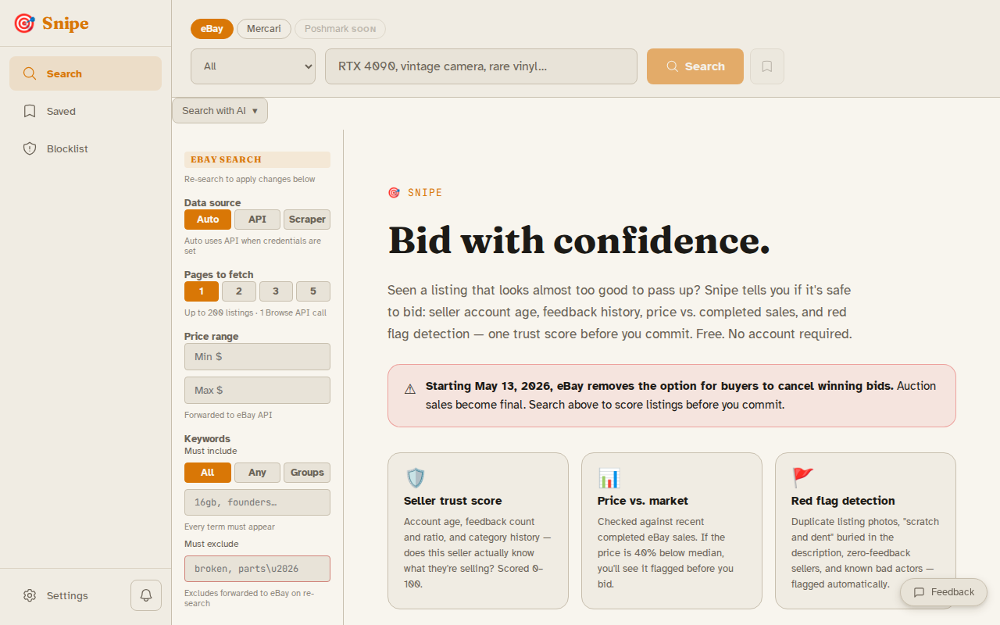
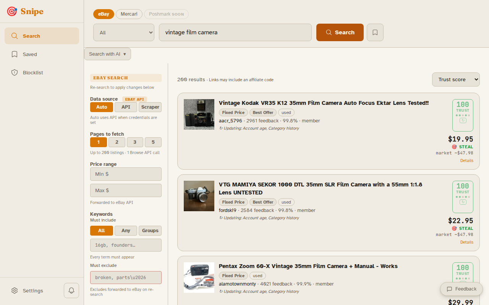

<!-- Logo coming soon — replace docs/snipe-logo.svg when final icon ships -->
<div align="center">
  

  # Snipe

  **Auction intelligence and sniping for people who don't trust the platform.**

  [](LICENSE)
  []()
  [](https://git.opensourcesolarpunk.com/Circuit-Forge/snipe/releases)
  [](https://git.opensourcesolarpunk.com/Circuit-Forge/snipe)
  [](https://docs.circuitforge.tech/snipe)

  *Part of the Circuit Forge LLC suite — "AI for the tasks the system made hard on purpose."*
</div>

---

<table>
<tr>
<td></td>
<td></td>
</tr>
</table>

---

## Why Snipe?

Auction platforms are designed to make you act fast and trust blindly. The closing countdown, the hidden price history, the new-account seller with one feedback — all of it is structured against the buyer.

Snipe inverts that. Before you place a bid, you get a trust score built from five independently sourced signals: seller account age, feedback volume, feedback ratio, price versus recent completed sales, and category history. A hard-coded red flag for new accounts or bad actors overrides the composite. Soft flags surface buried damage disclosures, duplicate photos, and listings that have been sitting unsold for weeks. When the listing is priced well below market, you see a STEAL badge — sourced from eBay Marketplace Insights, not from the seller's description.

The sniping engine — precise last-second bid submission with NTP (network time protocol) synchronization and soft-close handling — is next on the roadmap. The intelligence layer is live now.

---

## Features

### Listing intelligence (live)

- **Trust scoring** — five-signal composite score (0–100) per listing: account age, feedback count, feedback ratio, price vs. market, category history
- **Red flag detection** — hard flags for new accounts and established bad actors; soft flags for damage keywords, evasive language, duplicate photos, long-on-market listings, and significant price drops
- **Price vs. market** — listing price compared against completed-sale medians via eBay Marketplace Insights API (Browse API fallback)
- **Keyword filtering** — must-include (AND / ANY / OR-groups), must-exclude, category, price range; OR-groups expand into multiple targeted queries so eBay relevance doesn't silently drop variants
- **Saved searches** — one-click re-run that restores all filter settings
- **Background enrichment** — seller account age scraped via Playwright + Xvfb (Kasada/Cloudflare-safe headed Chromium); on-demand re-score per listing without re-searching
- **LLM query builder** — describe what you want in plain language; an LLM builds the search terms (paid tier)
- **Vision photo assessment** — condition scoring from listing photos via moondream2 locally or Claude vision (paid/cloud); VRAM-aware scheduling via circuitforge-core task scheduler
- **Affiliate link builder** — eBay Partner Network wrapping with user BYOK support and per-retailer disclosure

### Platforms

| Platform | Search | Trust scoring | Completed-sale comps |
|----------|--------|---------------|----------------------|
| **eBay** | Browse API + Playwright fallback | All 5 signals | Marketplace Insights + Browse fallback |
| **Mercari** | Playwright scraper | 3/5 signals (partial) | Phase 3 |
| CT Bids, HiBid, AuctionZip, Invaluable, GovPlanet, Bidsquare, Proxibid | Planned | Planned | Planned |

### Auction sniping engine (roadmap)

- NTP-synchronized last-second bid submission
- Soft-close detection and strategy adjustment
- Proxy bid ladder with configurable max
- Human approval gate before any bid executes
- Post-win workflow: payment routing, shipping coordination, provenance documentation

---

## Quick Start

**Requirements:** Docker with Compose plugin, Git. No API keys required to get started.

```bash
# One-line install — clones to ~/snipe by default
bash <(curl -fsSL https://git.opensourcesolarpunk.com/Circuit-Forge/snipe/raw/branch/main/install.sh)
```

Then open **http://localhost:8509**.

### Manual setup

Snipe's API image builds from a parent context that includes `circuitforge-core`. Both repos must sit as siblings:

```
workspace/
├── snipe/               ← this repo
└── circuitforge-core/   ← required sibling
```

```bash
mkdir snipe-workspace && cd snipe-workspace
git clone https://git.opensourcesolarpunk.com/Circuit-Forge/snipe.git
git clone https://git.opensourcesolarpunk.com/Circuit-Forge/circuitforge-core.git
cd snipe
cp .env.example .env   # add eBay API credentials if you have them (optional)
./manage.sh start
```

### Optional: eBay API credentials

Snipe works without credentials using its Playwright scraper fallback. Adding credentials unlocks faster searches and inline seller account age without an extra scrape:

1. Register at [developer.ebay.com](https://developer.ebay.com/my/keys)
2. Copy your Production **App ID** and **Cert ID** into `.env`
3. `./manage.sh restart`

---

## Tiers

| Tier | What you get |
|------|-------------|
| **Free** | eBay + Mercari search, full trust scoring, keyword filtering, saved searches — local LLM only |
| **Paid** | LLM query builder, background saved-search monitoring with alerts, cloud LLM option |
| **Premium** | Vision photo condition assessment, fine-tuned trust models, multi-user |
| **Ultra** | Human-in-the-loop operator — handles CAPTCHAs, phone calls, anything automation can't |

License key format: `CFG-SNPE-XXXX-XXXX-XXXX`

---

## Running

```bash
./manage.sh start         # start all services
./manage.sh stop          # stop
./manage.sh restart       # restart
./manage.sh logs          # tail logs
./manage.sh open          # open in browser
```

---

## Stack

| Layer | Technology | Port |
|-------|-----------|------|
| Frontend | Vue 3 + Pinia + UnoCSS + Vite (served via nginx) | 8509 |
| API | FastAPI (uvicorn) | 8510 |
| Scraper | Playwright + playwright-stealth + Xvfb (Kasada/Cloudflare-safe headed Chromium) | — |
| Database | SQLite (`data/snipe.db`) | — |
| Core | circuitforge-core (editable install) | — |

The scraper stack uses headed Chromium via Xvfb (X virtual framebuffer) with playwright-stealth for all platform access. Headless and `requests`-based approaches are blocked by eBay and Mercari.

---

## Documentation

Full documentation at **[docs.circuitforge.tech/snipe](https://docs.circuitforge.tech/snipe)** — setup guide, trust scoring algorithm, platform adapter reference, API docs, and self-hosting notes.

---

## Forgejo-primary

Snipe is developed and maintained on Forgejo at [git.opensourcesolarpunk.com/Circuit-Forge/snipe](https://git.opensourcesolarpunk.com/Circuit-Forge/snipe). GitHub and Codeberg are read-only mirrors. File issues and submit pull requests on Forgejo.

---

## Contributing

Bug reports and feature requests: open an issue on Forgejo. The discovery pipeline (scrapers, adapters, signal extraction) is MIT-licensed — pull requests welcome. AI trust-scoring features are BSL 1.1 — contributions are accepted but the license terms apply.

---

## License

Snipe uses a dual license:

| Component | License |
|-----------|---------|
| Discovery pipeline — scrapers, platform adapters, search, keyword filtering | [MIT](LICENSE-MIT) |
| LLM trust-scoring, query builder, vision assessment, AI features | [BSL 1.1](LICENSE-BSL) — free for personal non-commercial self-hosting; commercial use requires a paid license; converts to MIT after 4 years |

Privacy · Safety · Accessibility — co-equal, non-negotiable.

[circuitforge.tech](https://circuitforge.tech)
