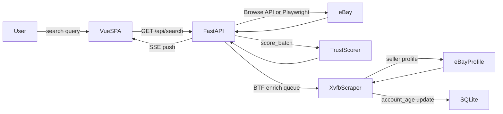

# Architecture

## Stack

| Layer | Technology |
|-------|-----------|
| Frontend | Vue 3, Pinia, UnoCSS |
| API | FastAPI (Python), host networking |
| Database | SQLite (WAL mode) |
| Scraper | Playwright + Chromium + Xvfb |
| Container | Docker Compose |

## Data flow

## Database layout

Snipe uses two SQLite databases in cloud mode:

| Database | Contents |
|----------|---------|
| `shared.db` | Sellers, listings, market comps, community signals, scammer blocklist |
| `user.db` | Trust scores, saved searches, user preferences, background tasks |

In local (self-hosted) mode, everything uses a single `snipe.db`.

WAL (Write-Ahead Logging) mode is enabled on all connections for concurrent reader safety.

## Seller enrichment pipeline

eBay's Browse API returns listings without seller account ages. Snipe fetches account ages by loading the seller's eBay profile page in a headed Chromium instance via Xvfb.

Each enrichment session uses a unique Xvfb display number (`:200`–`:299`, cycling) to prevent lock file collisions across parallel sessions. Kasada bot protection blocks headless Chrome and curl-based requests — only a full headed browser session passes.

## Affiliate URL wrapping

All listing URLs are wrapped with an eBay Partner Network (EPN) affiliate code before being returned to the frontend. Resolution order:

1. User opted out → plain URL
2. User has BYOK EPN ID (Premium) → wrap with user's ID
3. CF affiliate ID configured in `.env` → wrap with CF's ID
4. Not configured → plain URL

## Licensing

| Layer | License |
|-------|---------|
| Discovery pipeline (scraper, trust scoring, search) | MIT |
| AI features (photo analysis, description reasoning) | BSL 1.1 |
| Fine-tuned model weights | Proprietary |

BSL 1.1 is free for personal non-commercial self-hosting. SaaS re-hosting requires a commercial license. Converts to MIT after 4 years.
